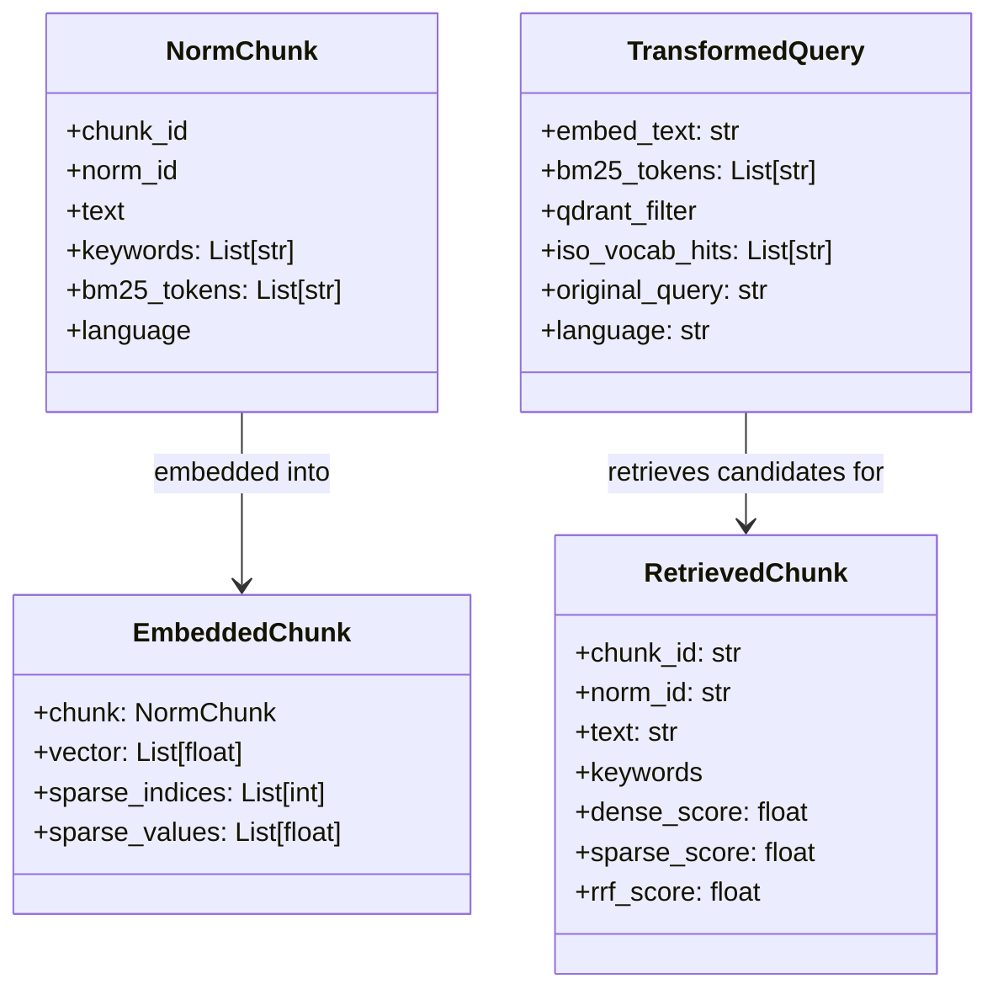

# BM25 / TF-IDF / Vocabulary Audit Report

**Project scope audited**
- `rag/ingestion_pipeline/enricher/enricher.py`
- `rag/ingestion_pipeline/vector_store/qdrant_store.py`
- `rag/shared/bm25/*`
- `rag/shared/vocabulary/*`
- `rag/retrival/query_transformer/Querytransformer.py`
- `rag/retrival/query_retrival/retriever.py`
- supporting models in `rag/ingestion_pipeline/embedder/models.py` and `rag/retrival/models.py`

**Audit date**
- April 28, 2026

---

## 1) Executive Summary

Your architecture is solid and well-organized: you correctly built a **shared tokenizer and shared vocabulary scanner** that are reused on both ingestion and query sides. That symmetry is a big strength for hybrid retrieval.

The key issue is this:

- Your BM25 path currently behaves closer to **IDF-weighted token presence** than true BM25, because token deduplication removes most term-frequency signal before BM25 scoring.

So your sparse path still works, but it is not using BM25 to its full potential.  
Dense + sparse + RRF fusion is implemented correctly, but sparse influence is rank-based (RRF), not explicitly weight-tunable.

---

## 2) How the System Works Today (Human Explanation)

Think of your pipeline as two lanes that meet at ranking time:

- **Dense lane**: semantic meaning via embeddings.
- **Sparse lane**: exact lexical anchors via BM25-style sparse vectors.

You also have two “signal boosters”:

- **TF-IDF keywords** extracted per chunk.
- **ISO vocabulary canonicalization** (EN/FR forms -> canonical ISO concepts).

### Ingestion side (documents -> index)

1. A clause becomes a `NormChunk`.
2. `Enricher` computes:
   - top-5 TF-IDF `keywords`,
   - `bm25_tokens` from text + clause digits + keyword terms + vocabulary hits.
3. `EmbedderService` creates:
   - dense vector,
   - sparse indices/values via `BM25SparseEncoder.encode(chunk)`.
4. `VectorStoreManager` upserts both vectors into Qdrant:
   - `dense` named vector,
   - `sparse` named vector.

### Query side (user query -> results)

1. `transform()` builds `TransformedQuery`:
   - query embedding text (`search_query: ...`),
   - query `bm25_tokens`,
   - scoped Qdrant filter (`norm_id`, `language`, optionally clause family).
2. `HybridRetriever`:
   - embeds query for dense search,
   - encodes query sparse vector with `encode_query()`,
   - runs Qdrant hybrid prefetch (dense + sparse),
   - fuses with `Fusion.RRF`.
3. results map to `RetrievedChunk` and then reranker handles final sorting.

---

## 3) Flow Diagram: BM25 + Keywords + Vocabulary Through Models

```mermaid
flowchart TD
    A[Parsed ISO text] --> B[NormChunk]
    B --> C[Enricher._tfidf_keywords]
    C --> C1[keywords: top-5 TF-IDF terms]
    B --> D[Enricher._bm25_tokens]
    D --> D1[tokenize_for_bm25\ntext + clause digits + bonus terms]
    D --> D2[scan_iso_vocabulary\ncanonical vocab hits + modal + clause refs]
    C1 --> D
    D2 --> D
    D --> E[NormChunk.bm25_tokens]

    B --> F[EmbedderService]
    E --> F
    F --> G[BM25SparseEncoder.encode\n(doc sparse indices/values)]
    F --> H[dense embedding vector]
    G --> I[EmbeddedChunk]
    H --> I

    I --> J[VectorStoreManager.upsert]
    J --> K[Qdrant collection\nnamed vectors: dense + sparse]

    L[User query] --> M[QueryTransformer.transform]
    M --> M1[scan_iso_vocabulary(query)]
    M --> M2[tokenize_for_bm25(query)]
    M1 --> M3[augment_bm25_tokens]
    M2 --> M3
    M3 --> N[TransformedQuery.bm25_tokens]
    M --> O[TransformedQuery.embed_text]

    O --> P[embed_text(query)]
    N --> Q[BM25SparseEncoder.encode_query\n(query sparse indices/values)]

    P --> R[HybridRetriever.query_points]
    Q --> R
    K --> R
    R --> S[Fusion.RRF]
    S --> T[RetrievedChunk list]
```

---

## 4) Model Interaction Diagram



---

## 5) BM25 Strategy: What Is Correct and What Is Diluted

## Correct parts

- **Corpus-level BM25 stats** are computed once over eligible chunks.
- **Standard Okapi formula** is used (`k1=1.2`, `b=0.75`).
- **Stable sparse index mapping** via `md5(token) % SPARSE_DIM`.
- **Query/document hash alignment** is strong and tested.
- **Index-time/query-time tokenization symmetry** is intentionally enforced.

## Diluted part (important)

`tokenize_for_bm25()` deduplicates tokens before they reach `BM25SparseEncoder.encode()`.

That means for many chunks:

- repeated terms do not increase `tf`,
- BM25 saturation behavior is largely bypassed,
- sparse vectors become closer to “unique token set with IDF/length effects”.

This is still usable, but no longer “full BM25 behavior”.

---

## 6) TF-IDF Keywords Strategy

What it does well:

- Computes TF-IDF over the ingestion corpus.
- Keeps top-5 terms per chunk.
- Prefers bigrams on tie, which helps with phrase-level specificity.

Where it under-delivers today:

- Keywords are injected into BM25 tokenization as bonus terms.
- But because tokenizer deduplicates, keywords mainly help only when they introduce new tokens.
- They do **not** produce a strong numeric boost by repetition or custom weight.

So keyword signal exists, but weaker than intended.

---

## 7) Vocabulary Role and Impact

This is one of your strongest design decisions.

You maintain EN/FR ISO vocabularies with canonical keys and many surface forms.  
The shared scanner is used on both ingestion and query paths, so matching is symmetric.

Practical effect:

- If document says one surface form and query uses another, canonical matching can still inject aligned sparse tokens.
- Clause patterns and modal terms are also captured, improving standards-style retrieval.

Main caution:

- Ensure `language` values are normalized (`EN`/`FR`) at boundaries to avoid accidental wrong-branch scanning.

---

## 8) Sparse Weight in Final Retrieval

Current final ranking = **RRF fused rank**, not weighted score blending.

So there is no explicit `alpha_dense` / `alpha_sparse` knob in current retrieval code.  
Sparse impact depends on:

- whether sparse prefetch is present,
- sparse ranking position,
- prefetch candidate depth.

This is a valid MVP strategy and often robust, but limited for systematic tuning/ablation.

---

## 9) Concrete Problems Found

1. **BM25 TF signal loss due to pre-encode dedup**  
   Largest retrieval-quality risk for sparse effectiveness.

2. **Boost mechanisms are mostly binary (present/not present), not weighted**  
   `keywords` and `specific_clauses` boosts are weaker than their names imply.

3. **Payload type mismatch for `keywords` / `related_clauses`**  
   Stored as comma string, consumed as list-like fields.

4. **`RetrievedChunk.chunk_id` uses Qdrant point UUID**  
   Not the original chunk ID from payload; hurts traceability/debug workflows.

5. **No sparse-vs-dense explicit tuning parameter in fusion**  
   Harder to optimize behavior per query class.

6. **Tests focus on mechanics, less on retrieval quality metrics**  
   Strong unit checks exist, but limited benchmark-style IR evaluation.

---

## 10) Improvement Plan (Recommended Order)

### Phase A (high impact, low conceptual risk)

1. **Preserve TF for ingestion BM25 tokens**
   - Add tokenizer mode:
     - ingestion-doc mode: keep duplicates,
     - query mode: optional dedup.
   - Keep output deterministic.

2. **Fix payload schema consistency**
   - store arrays as arrays in Qdrant payload (`keywords`, `related_clauses`),
   - add backward-compatible parser for older comma-form payloads.

3. **Use original chunk ID in retrieval model**
   - `chunk_id = payload["chunk_id"]`,
   - keep point UUID in a separate debug field if needed.

### Phase B (quality tuning)

4. **Introduce explicit boost weights**
   - weighted query sparse values:
     - base token = 1.0
     - iso vocab token = 1.5–2.0
     - specific clause digits = 2.0+
   - or controlled token replication strategy.

5. **Add hybrid tuning modes**
   - mode 1: current RRF (default, fast).
   - mode 2: separate dense+sparse retrieval with weighted merge (for experiments/eval).

### Phase C (evaluation maturity)

6. **Build benchmark set + metrics**
   - measure Recall@k, MRR, nDCG by query category:
     - clause-number-heavy
     - synonym-heavy
     - modal-heavy
     - bilingual queries
   - run dense-only vs hybrid-RRF vs weighted hybrid.

---

## 11) Suggested Acceptance Criteria for “BM25 finalized”

- BM25 document vectors use true term frequency (no unintended dedup flattening).
- Query boosts are numerically tunable and versioned.
- Payload schema is type-consistent end-to-end.
- Hybrid retrieval has at least one tunable weighting mode (even if RRF remains default).
- Offline evaluation dashboard exists with per-query-family metrics.

---

## 12) Final Verdict

Your design foundation is strong and professional:

- shared tokenization,
- shared vocabulary scanner,
- proper sparse storage in Qdrant,
- clean separation between ingestion/retrieval models.

The biggest blocker to “finalized BM25 effectiveness” is the current token dedup behavior that suppresses BM25 TF dynamics.  
Fix that first, then tune explicit sparse boosts and evaluation metrics; you will get a measurable retrieval lift with minimal architecture changes.

